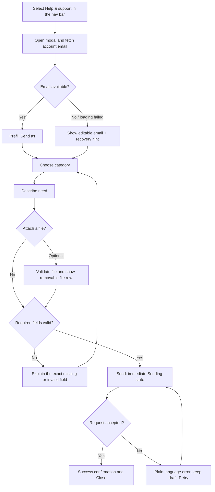

# Support Request Flow

**Problem** — A learner who is blocked, sees something broken, or has an idea needs a fast way to reach the team without leaving their current task, guessing where feedback belongs, or retyping information the app already knows. A generic email link asks the learner to supply routing context, loses useful attachments, and gives no clear confirmation that the message arrived.

**Job to be done** — When I need help with my myTCFLab account or experience, let me describe it and send the right context in one short interaction, so I can get back to studying confident that the team received it.

## Goals / non-goals

### Goals

- Offer one consistently labelled **Help & support** entry point in the signed-in navigation bar, wherever a learner can be working.
- Open a compact, accessible dialog with the account email already filled in as **Send as**.
- Route the request with one required category: Bug, Question, Feature request / feedback, Account & access, or Other.
- Keep the path to send to two required choices (category and details); attachment is optional.
- Make validation, attachment, sending, success, and retry states visible without losing the learner's entered text.

### Non-goals

- No support chat, promised response time, ticket tracker, or staff access to the learner's essay unless they intentionally attach it.
- No requirement to upload a screenshot or explain an issue in a prescribed template.
- No custom file manager or a hidden attempt to collect diagnostic data without saying so.

## Flow and decision rationale



| Decision | Why it reduces friction |
| --- | --- |
| Prefill the authenticated email, but let the learner correct it if needed. | It removes repetitive typing while still letting someone choose a reachable reply address. A read-only account identity can send a reply to an inbox they no longer use. |
| Ask for category before details. | The category is visible routing help, not extra paperwork. It also allows one useful, category-specific prompt instead of a long generic instruction. |
| Do not preselect a category. | Guessing the learner's intent risks misrouting their request. A required empty selection makes the one decision explicit. |
| Keep the form in one modal rather than a multistep wizard. | These short, infrequent requests do not earn a separate navigation or a progress burden. The learner can scan every required action at once. |
| Preserve text, category, email, and valid attachments after any error. | Retyping a careful bug description is especially costly when the learner is already frustrated. |
| Confirm receipt, not a response-time promise. | The interface must not promise a service level the business has not committed to. |

## Wireframe and content hierarchy

The dialog is a single-column sheet, approximately 560–640 px wide on desktop and full-width with safe margins on small screens. The action stays visible after an attachment is added; the form body scrolls inside the dialog if needed.

```text
Navigation bar (signed in):  Dashboard · Practice · Full task · [Help & support] · Settings · Account

┌───────────────────────────────────────────────────────────┐
│ Support                                              [Close]│
│ Tell us what you need. We’ll use this to get it to the     │
│ right person.                                               │
│                                                            │
│ Send as                                                     │
│ [ learner@example.com                                  ]   │
│ We’ll reply to this address.                                │
│                                                            │
│ What’s this about? *                                       │
│ [ Choose one…                                           ▾ ] │
│                                                            │
│ Details *                                                   │
│ [ What can we help with?                                ]  │
│ [                                                        ]  │
│                                                            │
│ Attachment (optional)                                      │
│ [ Add a file ]  screenshot.png (1.2 MB)              [×]   │
│                                                            │
│                                    [Cancel] [Send request] │
└───────────────────────────────────────────────────────────┘
```

Place **Help & support** after the primary study destinations and before utility icons. It is a visible text button—not an unlabeled help icon—because support is an infrequent, high-need action and must remain discoverable. It opens the dialog without navigating away, so any active writing workspace stays in place. The visual reference's dark, low-chrome presentation is appropriate when it matches the selected application theme. Preserve the app's own type scale, focus treatment, and button semantics rather than copying visual values that conflict with it. The modal must remain readable in both themes and at 200% zoom.

## UX copy

The following is the English source copy. It belongs in the existing locale-copy contract before the UI is shipped, so the structure remains equivalent in every supported locale.

| Element | Copy |
| --- | --- |
| Trigger | Help & support |
| Modal title | Support |
| Intro | Tell us what you need. We’ll use this to get it to the right person. |
| Email label | Send as |
| Email help | We’ll reply to this address. |
| Category label | What’s this about? |
| Category placeholder | Choose one… |
| Category options | Bug; Question; Feature request / feedback; Account & access; Other |
| Details label | Details |
| Bug prompt | What were you trying to do, and what happened instead? Steps, messages, and screenshots can help. |
| Question prompt | What are you trying to do? Include the task or feature you’re using if you can. |
| Feedback prompt | What would make myTCFLab work better for you? |
| Account prompt | What do you need help accessing? Never include your password or a verification code. |
| Other prompt | Tell us what you need help with. |
| Attachment label | Attachment (optional) |
| Add-file action | Add a file |
| Submit | Send request |
| Submitting | Sending… |
| Success title | Your message has been sent |
| Success body | Thanks — we’ll reply to {email}. |
| Success action | Close |
| Missing category | Choose a category so we can route your request. |
| Missing details | Tell us a little more so we can help. |
| Invalid email | Enter an email address where we can reach you. |
| Send failure | We couldn’t send your message. Your details are still here — check your connection and try again. |
| Retry action | Try again |

Use a normal sentence-case label, not an all-caps field heading. Keep the asterisk visually associated with each required label and state "required" in the programmatic label. Do not put the only instruction in placeholder text; it disappears as the learner types.

## State specification

| State | Interface behaviour |
| --- | --- |
| Initial / email loading | Open immediately. Show a disabled `Send as` field with a small "Loading your email…" status; the learner can inspect the rest of the form rather than waiting on a blank modal. |
| Email resolved | Fill the field from the authenticated account and remove the loading status. Do not expose an internal user ID. |
| Email unavailable | Change the field to editable and say, "We couldn’t load your account email. Enter an address where we can reach you." This keeps support available during a profile-read failure. |
| Empty form | `Send request` is disabled until a valid email, a category, and non-whitespace details are present. This prevents a round trip for avoidable errors while the inline required markers remain visible. |
| Category changed | Update only the details prompt. Never erase a description if the learner changes their mind; category changes are common while framing a request. |
| Attachment selected | Show a file row with name, size, upload/validation status, and a keyboard-operable Remove action. Do not rely on an icon alone. |
| Invalid attachment | Reject before submission with the specific file name and the supported limit/type. Keep the rest of the form and other valid files intact. Server validation must repeat client checks. |
| Sending | Change the primary label to `Sending…`, disable duplicate sends, and expose a polite live status. Keep a way to close the dialog; closing must either abort the request and preserve the draft locally, or clearly say that the message may still finish sending. The implementation must choose one behaviour—never silently discard an in-flight request. |
| Success | Replace the form with the success confirmation and `Close`. Return focus to the Help & support trigger after close. No invented case number or response-time guarantee. |
| Submission error | Keep every entered field and attachment. Put the concise error near the action, move focus to it, and offer `Try again`. Do not reset the category to its placeholder. |
| Session expired | Explain that the request cannot be sent from the current session and provide a sign-in action plus an unauthenticated contact route. |

### Attachments

The product needs a server-owned attachment policy before UI copy can claim exact formats or sizes. Once set, show the same allowed types and per-file limit beside **Add a file** and enforce them both client- and server-side. The reference allows images, text, PDF, JSON, and ZIP files up to 10 MB each; treat that as a useful direction, not a requirement to claim until storage, malware scanning, retention, and staff access policies exist. Never allow a file attachment to block a learner from sending the written request if the file cannot upload.

## Accessibility and recovery requirements

- Use a real labelled dialog: initial focus goes to the first unfinished required control, focus stays within while open, Escape closes only when no native select is open, and closing returns focus to the trigger.
- Associate every input with a visible label and any help/error text. Announce dynamic category prompts, upload status, send status, and errors through an appropriate live region without repeating the whole form.
- Support keyboard file selection, removal, select navigation, and submit. A drag-and-drop target may be an enhancement, never the only attachment path.
- Ensure the close control has an accessible name, errors are conveyed without color alone, and touch targets meet the app's standard interactive size.
- Keep a local, session-scoped draft only if the user closes after entering content; clear it after confirmed success or an explicit discard. Do not put sensitive attachment bytes in browser storage.

## Business requirement in tension

**Account & access** is a required category, yet an email-prefilled modal is naturally available only after a learner signs in. The learners most likely to need account help may be unable to reach it. Keep a public support path on the login/blocked-account journey, with an editable email and the same category/details fields (or a clearly shown support address as an interim path). Do not present an authenticated-only modal as complete coverage for account access.

## Acceptance and usability check

- A signed-in learner can open support from any core screen, confirm or change their reply address, choose one category, add details, optionally attach a file, and send without leaving the current page.
- A failed profile read, invalid upload, expired session, and failed submission each offer a visible recovery path without data loss.
- In a five-learner usability check, at least four can send a bug report with a screenshot and identify where a reply will arrive without assistance. Record whether participants hesitate at `Send as`; if they interpret it as an impersonation control rather than their reply address, revise the label with the business owner despite the requested wording.
