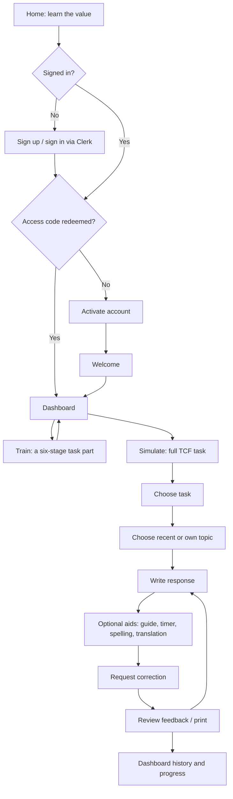
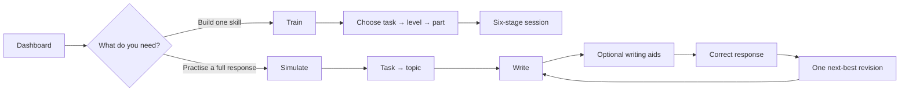

# End-to-end UX audit — MyTCFLab

**Reviewed:** 10 September 2026  
**Scope:** Public entry, authentication/admission, Dashboard, Train, Simulate
(writing workspace), inline spelling assistance, feedback, history, settings,
support, the walkthrough, and the owner-facing operational experience.

This is a product-flow and interface review of the current implementation and
copy. It is not a visual QA sign-off: browser automation was not available in
this environment, so responsive rendering and Clerk-authenticated journeys
still need a device/browser pass before release.

## Executive assessment

The product has a thoughtful, unusually complete set of recovery states:
unsaved drafts are guarded, provider failures preserve the learner's work,
the full-task and focused-practice routes are intentionally separate, and the
accessible structure of the editor, modal, walkthrough, and destructive
actions is strong.

The central UX risk is **trust**, not layout. The live product calls the new
feature a grammar checker in the walkthrough, while it only detects possible
misspellings. A learner preparing for a high-stakes exam can reasonably infer
that missing words, agreements, punctuation, and grammar have been checked
when they have not. Correct this before promoting the feature.

The next biggest opportunity is reducing the number of choices a new learner
must parse. The product has good capabilities, but they surface as a wide
collection of controls before the learner has formed a draft. Progressive
disclosure and clearer “what can I do now?” guidance will preserve power while
making the first useful action obvious.

## Current learner journey

### State coverage that is working well

| Moment | Current protection | Why it reduces learner friction |
| --- | --- | --- |
| Task/topic change after work has started | Confirmation before clearing context, draft, or feedback | Prevents a common, costly loss of writing. |
| Topic retrieval or correction failure | A specific retryable state; draft remains in place | The learner can recover without retyping. |
| Timed session | Persists locally and uses an absolute deadline | The timer remains credible after a tab is backgrounded. |
| Inline suggestion application | Replaces only the flagged text and restores the caret | It does not break writing flow or selection. |
| Learning feedback | Feedback is marked stale after a learner changes the draft | Prevents prior feedback being mistaken for feedback on the revised response. |
| Destructive progress/history actions | Confirmation and status announcements | Supports user control and keyboard/screen-reader recovery. |
| Operational logging | Sanitized failures rather than stored drafts | Gives the owner enough diagnosis without exposing student writing. |

## Findings and recommendations

### P0 — Correct the spelling-check promise everywhere it is learner-facing

**Observed:** The implementation and its dedicated documentation explicitly
state that the feature checks spelling only. The full walkthrough currently
says it will “Catch spelling and grammar issues as you type” in every locale,
and its body says grammar issues are underlined.

**Why it matters:** This is a capability claim, not cosmetic copy. Silence
after a grammar or missing-word mistake can be interpreted as confirmation that
the sentence is correct. That is especially harmful in exam preparation.

**Recommendation:** Use one precise name and explanation consistently:

> **Spell check: Off**  
> Flags possible spelling mistakes in French. It does not check grammar,
> punctuation, or TCF scoring.

For the tour:

> **Catch possible spelling mistakes as you type**  
> Turn on spell check to underline words the French dictionary may not
> recognise. Click an underline to choose a correction. Review grammar and
> missing words in your full correction instead.

If grammar and missing-word detection are a non-negotiable business promise,
the product needs the requested self-hosted LanguageTool integration before
this feature is promoted. Copy cannot make a spelling-only engine meet that
requirement.

### P1 — Make the disabled spelling control explain its prerequisite

**Observed:** The spelling-control button is disabled until a topic exists,
which correctly prevents out-of-context checking. Its persisted label can
still read “Spell check: On” while it is disabled after a task/topic reset.

**Why it matters:** “On” normally means currently running. Here it means a
saved preference which cannot act yet. The user has no visible explanation
for the disabled control or what unlocks it.

**Recommendation:** Keep the requested topic gate, but render a distinct
unavailable state:

> **Spell check** · Choose a topic to enable

After a topic is selected, restore the explicit Off / On choice. Add the
same short helper to the Writing guide and Timed task controls so all three
follow one predictable pattern. Do not hide the controls; seeing the available
aids helps the learner plan their next step.

### P1 — Shorten and stage the first-run walkthrough

**Observed:** The comprehensive “Take a tour” is now 21 steps and drives
real workspace state (topic loading, sample text, correction preview).

**Why it matters:** A 21-step sequential tutorial is a high commitment before
a learner has taken a meaningful action. The same learner must also process a
new dashboard, a six-step practice route, and a dense full-writing workspace.
The walkthrough is excellent as a reference, but too linear as the default
orientation mechanism.

**Recommendation:** Make the initial path a three-step “start here” guide:

1. Choose **Train** or **Simulate**, with one-sentence fit guidance.
2. On the chosen page, point to the immediate first control.
3. At the first editor, point to **Correct response** and say feedback is not
   an official TCF score.

Keep the full tour as an optional, resumable “Explore all tools (about 3 min)”
experience. Group the editor aids into one step labelled “Optional writing
aids” with expandable mini-cards for Guide, Timer, Spell check, and
Translation. This reduces tour length without removing discoverability.

### P1 — Restore a clear primary action for returning Dashboard users

**Observed:** The empty dashboard offers two excellent starting cards, but
once a learner has any activity the page becomes progress, history, and (if
present) a Practice card. There is no parallel, visible **Start a full task**
action.

**Why it matters:** A returning learner arrives with an intent (“practise
now”), not an intent to inspect a chart. Requiring them to rediscover the
header navigation creates a small but repeated delay.

**Recommendation:** Add a persistent Dashboard action row below the greeting:

Continue practice (primary when a local session exists) · Start a full task
· View history.

Use the same wording and placement in empty and populated states. Progress
should support the next practice decision, rather than compete with it.

### P1 — Clarify the admission requirement before account creation

**Observed:** The public home page has a generic “Get started” CTA. The
access-code requirement appears only after sign-up/sign-in and at activation.
Activation and its welcome modal are hard-coded in English while the rest of
the application supports English, French, Spanish, and Portuguese.

**Why it matters:** A user without a code can spend time creating an account
only to hit an unexpected blocked path. A mixed-language admission moment is
particularly disorienting for a language-learning product.

**Recommendation:** Add quiet pre-disclosure directly beneath the public CTA:

> Access is by invitation code. Already have one? Create your account to
> activate it.

Also localize all activation, welcome, blocked-account, and temporary-account
unavailable copy through the existing app-copy contract. This is a conversion
and trust improvement, not merely a translation task.

### P2 — Reduce decision density in the full writing workspace

**Observed:** As soon as a topic is selected, the editor header contains the
target-level selector, writing guide toggle, timed task toggle, spell-check
toggle, live check status, word counter, and timer. The task/topic context
appears immediately above it.

**Why it matters:** These are useful tools, but their equal visual weight
makes it harder for a tired learner to find the primary job: write a response.
Target level is also adjacent to editor controls even though it affects the
guide and model example, not the learner's own correction.

**Recommendation:** Keep word count permanently visible. Move the remaining
optional tools behind a Writing aids disclosure that preserves each tool's
state and exposes a one-line status when active, for example:

> Writing aids · Guide on · Spell check off · No timer

Place Target level inside the guide/model-answer area, labelled “Target level
for guidance and model answer.” This makes the semantic consequence clear and
restores a calmer writing surface.

### P2 — Turn feedback into a deliberate revision loop

**Observed:** The correction modal is rich and accessible, with Overview,
Compared, Comments, and Methodology tabs plus printing. Closing it returns a
learner to the unchanged draft; they must infer how to turn findings into a
revision.

**Why it matters:** The user’s real goal is not receiving feedback; it is
improving the next draft. A four-tab report can end in passive reading rather
than a next action.

**Recommendation:** On the Overview tab, introduce a single “Next best
revision” panel before the detailed scores:

> **Revise one thing first**  
> [Specific feedback-derived action]  
> **Back to my draft**

The CTA should close the modal and focus the editor. Keep the detailed tabs
and print action for analytical learners, but make revision the default exit.

### P2 — Make practice availability legible before selection

**Observed:** Learners choose task, level, then part. Incomplete paths are
only explained after a part is selected; selected unavailable combinations can
require an additional level change.

**Why it matters:** The selection sequence creates the expectation that every
choice is startable. Discovering a dead end after a third choice costs
attention and can make the curriculum feel unfinished rather than intentionally
scoped.

**Recommendation:** In the part picker, show availability directly in option
text, e.g. “Partie 4: … — available at B2 and C1” or “Coming soon at C2.”
After task selection, show a compact availability count beside each level.
Keep unavailable parts visible to preserve the task blueprint, but prevent
surprise.

### P2 — Use user language in owner operations

**Observed:** The admin log is appropriately privacy-conscious but exposes
operational terms such as reason codes, HUNSPELL_FR, UTC-exclusive ranges, and
provider-level concepts in a dense table.

**Why it matters:** The owner needs to decide what to do, not decode an
internal event taxonomy. This becomes more important if spell-check failure
logs are part of an active support process.

**Recommendation:** Add a first-column “What happened / what to do” summary
from the trusted registry, for example: “Spell checking was temporarily
unavailable — learner can continue writing; inspect deployment health if this
repeats.” Keep the raw, safe identifiers in an expandable Technical details
section. Add a quick filter chip: “Spell check”.

## Recommended target flow

The flow deliberately separates **learning a move**, **performing a whole
task**, and **revising a draft**. Each route has one primary decision at a
time; secondary tools remain discoverable but do not compete with it.

## UX copy decisions for the spelling feature

| State | Recommended visible copy | Rationale |
| --- | --- | --- |
| No topic | “Spell check · Choose a topic to enable” | Explains a disabled control instead of implying a fault. |
| Ready, off | “Spell check: Off” | Gives the learner control and makes the default clear. |
| Checking | “Checking spelling…” | Provides immediate status without blocking writing. |
| Possible issue | “Possible spelling mistake” | Calibrates uncertainty; dictionaries have false positives. |
| No replacement | “No suggestion is available. You can keep writing or edit this word yourself.” | Gives a clear recovery route. |
| Service error | “Spell check is temporarily unavailable. Your writing is still safe.” | Prevents an operational failure from feeling like lost work. |
| Scope note | “Spelling only — grammar and punctuation are not checked here.” | Prevents over-reliance. |

## Validation plan before implementation

1. Test five new learners who have an access code and five who do not. Ask
   them to narrate how they expect to get access before they click anything.
2. Ask six learners across B2–C2 to start a task and find the writing aids.
   Measure time to a first draft sentence and whether they understand what
   spell check does *not* cover.
3. Run the proposed compact orientation against the 21-step tour. Measure
   completion, voluntary use of the full tour, and whether learners can later
   find Guide, Timer, Spell check, and Correction without prompting.
4. Give six learners an intentionally grammar-wrong but correctly spelled
   French sentence. Confirm that none interpret the absence of an underline
   as a grammar endorsement.
5. Have the owner resolve a simulated spell-check outage from the operational
   log. Success is finding the impact, knowing learner drafts are not exposed,
   and identifying the next operational action in under two minutes.

## Implementation sequence

1. Fix the spelling/grammar capability claim and topic-gated state. Re-run
   localization and component tests.
2. Localize the access-code and account recovery surfaces; add the public
   admission disclosure.
3. Add persistent Dashboard “start/continue” actions.
4. Prototype the aids disclosure and feedback revision CTA with learners
   before moving controls or changing the tour.
5. Only then shorten the default walkthrough, retaining the full tour as an
   opt-in reference.

